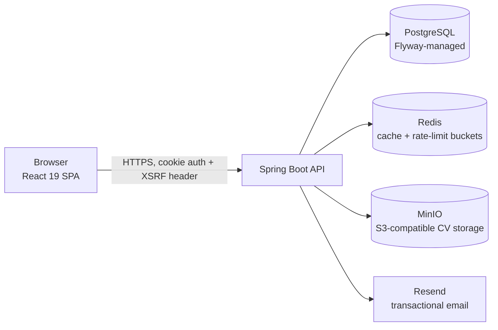

# Krino

[](https://github.com/4bderrahmane/krino/actions/workflows/ci.yml)
[](https://github.com/4bderrahmane/krino/actions/workflows/codeql.yml)
[](./LICENSE)

Krino is an applicant tracking and interview-scheduling platform. Recruiters publish
openings, candidates apply with a CV, and the hiring team books interviews against
interviewers' published availability. A slot can hold exactly one interview, and that
rule is enforced by a unique constraint in the database rather than by application code,
so concurrent bookings cannot double-book an interviewer.

The repository is a monorepo of two independently deployable services:

| Path | Service | Stack |
|------|---------|-------|
| [`server/`](./server) | REST API | Java 25, Spring Boot 4.1, Spring Security, Spring Data JPA, PostgreSQL 18, Flyway, Redis, MinIO, MapStruct, Resend, springdoc OpenAPI |
| [`client/`](./client) | Web frontend | React 19, TypeScript, Vite 7, Tailwind CSS 4, TanStack Query, React Router 7, axios, i18next |

> This repository was created by merging two previously separate repositories. The full
> commit history of both projects is preserved under the `client/` and `server/` paths.

---

## Contents

- [What it does](#what-it-does)
- [Architecture](#architecture)
- [API surface](#api-surface)
- [Domain model and data integrity](#domain-model-and-data-integrity)
- [Security](#security)
- [Caching and rate limiting](#caching-and-rate-limiting)
- [Consistency and side effects](#consistency-and-side-effects)
- [Error responses](#error-responses)
- [Getting started](#getting-started)
- [Configuration](#configuration)
- [Testing](#testing)
- [Continuous integration](#continuous-integration)
- [Project layout](#project-layout)
- [Security policy](#security-policy)
- [License](#license)

---

## What it does

**Anonymous visitors** browse the published catalogue: paginated job listings and
departments, with no account and no session required.

**Candidates** register with a CV, verify their email, and apply to openings. That CV
becomes the *base* CV on their profile, reusable for a new application in one call or
overridable per application. A candidate can hold at most one application per opening,
follows its status (pending, under review, interview scheduled, accepted, rejected), and
can delete it.

**Interviewers** publish availability slots, see the interviews assigned to them, and
record outcome notes and a hiring recommendation.

**HR managers** own the opening lifecycle (draft, scheduled, open, paused, closed, filled,
cancelled, archived), triage applications, approve pending accounts, and schedule
interviews into open slots. The lifecycle is a real state machine implemented on the `Job`
entity itself: publication requires a title, a description, and a department; only an open
posting can be paused; a posting must be closed before it can be archived; an archived
posting cannot be modified; and a posting with applications or interviews cannot be
deleted at all, only closed.

**Admins** additionally create staff accounts. A generated initial password is emailed to
the new account, which is then forced through a password change on first sign-in.

The UI ships in English and French (i18next), and the API is documented with OpenAPI.

## Architecture



Every request entering the API passes through a fixed chain:

```
RateLimitFilter -> CsrfFilter -> CsrfCookieFilter -> JwtCookieAuthenticationFilter -> @PreAuthorize -> controller
```

Rate limiting runs first so that a flood is rejected before any cryptographic or database
work happens. Authentication is stateless (`SessionCreationPolicy.STATELESS`); there is no
server-side HTTP session to fixate or exhaust.

Inside the API the layering is conventional and strictly enforced: controllers handle HTTP
and authorization, services hold transactions and business rules, repositories hold
queries, and MapStruct mappers convert entities to DTOs so no JPA entity is ever
serialized to a client.

## API surface

All routes are prefixed with `/api`. Authorization is expressed with method-level
`@PreAuthorize`, using colon-namespaced permission authorities (`job:create`,
`interview:update`, ...) rather than raw role checks wherever a permission exists.

| Area | Routes | Access |
|------|--------|--------|
| Auth | `POST /auth/register` (multipart), `/auth/login`, `/auth/logout`, `/auth/refresh`, `/auth/forgot-password`, `/auth/reset-password`, `/auth/verify-email`, `/auth/resend-verification`, `GET /auth/csrf` | Public, rate-limited |
| Public catalogue | `GET /public/jobs`, `GET /public/jobs/{publicId}`, `GET /public/departments` | Anonymous, `GET` only |
| Jobs | CRUD on `/jobs` plus `/jobs/{publicId}/publish`, `/pause`, `/close`, `/archive` | `job:*` permissions |
| Departments | CRUD on `/departments` | `department:*` permissions |
| Applications | CRUD on `/applications`, `GET /applications/me`, `PUT /applications/{publicId}/resume` (multipart), `PUT .../resume/from-base`, `GET .../resume`, `DELETE .../resume` | `application:*` permissions |
| Interviews | CRUD on `/interviews`, `GET /interviews/me` | `interview:*` permissions |
| Slots | CRUD on `/slots` | `slot:*` permissions |
| Users | `/users`, `/users/me`, `/users/me/password`, `/users/me/resume`, `PATCH /users/{publicId}/approval`, `GET /users/non-approved` | Self, or `ADMIN` / `HR_MANAGER` |
| Ops | `GET /actuator/health` | Public, status only |

Interactive docs: Swagger UI at `/swagger-ui.html`, spec at `/v3/api-docs`. Both are on in
dev and off in production unless `SPRINGDOC_ENABLED=true` is set explicitly.

Every paged endpoint caps `?size=` at 100 (default 20) and runs the incoming `Pageable`
through a per-endpoint [`SortWhitelist`](server/src/main/java/com/krino/backend/utility/SortWhitelist.java),
so a client cannot sort by an arbitrary persistent property such as a password hash or a
lazily-joined relation.

## Domain model and data integrity

The schema is a single Flyway migration,
[`V1__initial_schema.sql`](server/src/main/resources/db/migration/V1__initial_schema.sql),
and correctness is pushed into the database wherever it can be:

- **One interview per slot**: `uk_interviews_slot UNIQUE (slot_id)`, which is what makes
  double-booking impossible under concurrency.
- **One application per candidate per job**: `uk_applications_job_candidate UNIQUE (job_id, user_id)`.
- **One role per user**: composite primary key on `user_roles (user_id, roles)`.
- **Coherent slots**: `CHECK (end_time > start_time)`, plus an all-or-none check on the
  booking window columns.
- **Token hashes are hashes**: `CHECK (octet_length(token_hash) = 32)` on all three token
  tables, so a raw token can never be stored where a digest belongs.
- **Optimistic locking**: `@Version` on `Job`, `Application`, `Interview`, `Slot`, and
  `Department`; a lost update surfaces as a `409` instead of silently overwriting.
- **Auditing**: `created_by` / `last_modified_by` are populated from the security context
  and sized to match `users.email`.
- **Partial indexes** for the hot filtered reads (pending approvals, active tokens,
  available slots, published jobs).

Entities follow a dual-ID convention: an internal `BIGINT` surrogate key that never leaves
the server, and a public `UUID` (`public_id`) used in every URL and payload, so row counts
and insertion order are not inferable from the API.

## Security

Design-level threat coverage lives in [THREAT_MODEL.md](./THREAT_MODEL.md) (threat, vector,
control, status, with file references). In summary:

**Credentials.** Passwords are hashed with **Argon2id** (`Argon2PasswordEncoder.defaultsForSpringSecurity_v5_8()`,
BouncyCastle declared explicitly rather than inherited transitively).

**Sessions.** Access tokens are short-lived JWTs (15 min default) delivered in
`HttpOnly` cookies, never in `localStorage`. The subject is the user's public UUID, and a
`type` claim pins the token to the access role so a refresh token cannot be replayed as an
access token. Refresh tokens (30 d default) are 64-byte random values stored only as
**HMAC-SHA256 digests**; they are rotated on use, and reuse of a consumed token revokes the
entire family. Sessions are also revoked wholesale on password change.

**Authorization.** Four roles (`ADMIN`, `HR_MANAGER`, `INTERVIEWER`, `CANDIDATE`) expand to
granular permission authorities. Ownership checks are expressed in the same layer
(`#publicId == authentication.principal.publicId`), and the public catalogue is matched on
`GET` alone, so a write endpoint later added under `/api/public/**` falls through to
`.authenticated()` instead of inheriting anonymous access by accident.

**Browser layer.** CSRF protection uses Spring Security's SPA mode with a cookie
repository, `SameSite=Strict`, and the `X-XSRF-TOKEN` header. CORS is an explicit
allow-list of origins with credentials enabled.

**Uploads.** CVs must be PDFs and are verified by magic bytes (`%PDF-`), not by the
client-supplied content type, and are capped at 5 MB by both the multipart layer and the
storage service. Objects are keyed by UUID, so an uploaded filename never becomes a path.

**Production guardrails.** [`ProductionConfigurationValidator`](server/src/main/java/com/krino/backend/configuration/ProductionConfigurationValidator.java)
refuses to let the application finish starting under the `prod` profile if cookies are not
`Secure`, if `ddl-auto` is a destructive mode, if the JWT and refresh secrets are missing
or identical, if CORS origins are wildcarded / non-HTTPS / localhost, if MinIO still uses
default credentials, or if log-only mail (which prints reset links and initial passwords)
is still enabled.

**Operational surface.** Actuator exposes only `/actuator/health`, with components and
details suppressed, so the public probe returns at most `{"status":"UP"}`. A nightly job
purges expired and revoked tokens.

## Caching and rate limiting

Redis backs both.

Read caches are declared per name with a serializer pinned to that cache's value type;
Jackson default typing is deliberately avoided, because it would make write access to Redis
equivalent to arbitrary class instantiation in the JVM. Unknown cache names fail fast
instead of being invented with untyped defaults.

| Cache | Contents | TTL |
|-------|----------|-----|
| `jobListings` | Paged public job listings | 2 min |
| `jobs` | Single job by public ID | 10 min |
| `departments` | Paged departments | 1 hour |

Writes are synchronous and transaction-aware, so a rolled-back mutation can never leave
phantom state in the cache, and "the mutation returned, therefore the cache is consistent"
actually holds.

Rate limiting is per-IP token buckets (Bucket4j over Lettuce) with two separate budgets:
**10 requests/min** on the auth endpoints, and a looser **120 requests/min** on the
anonymous catalogue, because one page view costs several requests and the auth budget
would break ordinary browsing while doing nothing extra against a scraper.

## Consistency and side effects

External side effects are attached to transaction outcomes rather than to method calls:

- Emails are published as events and sent on `AFTER_COMMIT`, asynchronously on a dedicated
  executor, so a failed transaction never emails the user and a slow SMTP hop never blocks
  the request thread.
- Stored CVs are reconciled through the same mechanism: an object uploaded during a
  transaction that later rolls back is deleted on `AFTER_ROLLBACK`, and a replaced or
  deleted object is removed on `AFTER_COMMIT`. Object storage therefore does not leak
  orphans when the database says the operation never happened.

## Error responses

Every error is an RFC 9457 `application/problem+json` document produced by a single
`@RestControllerAdvice`. Responses carry a stable machine-readable `type`
(`urn:problem-type:resource-not-found`, `urn:problem-type:rate-limited`, ...) drawn from a
closed [`ErrorCode`](server/src/main/java/com/krino/backend/utility/ErrorCode.java)
catalogue, so the client branches on the code rather than on prose. Validation failures,
constraint violations, integrity violations, optimistic-lock conflicts, transaction
failures, and unmapped exceptions all funnel through the same factory, and internal detail
is logged rather than returned.

## Getting started

### Prerequisites

- **JDK 25** (the Maven wrapper `./mvnw` is included, so a local Maven install is optional)
- **Node.js 22+** (Vite 7 requires 20.19+ / 22.12+; CI builds on 22)
- **Docker** and **Docker Compose** (required for the integration tests, and the easiest way
  to get PostgreSQL, Redis, and MinIO)

### Run the whole stack

```bash
cp server/.env.example server/.env
```

```bash
docker compose --profile app up --build
```

| Service | URL |
|---------|-----|
| Client (nginx) | http://localhost:5173 |
| API | http://localhost:8080 |
| Swagger UI | http://localhost:8080/swagger-ui.html |
| MinIO console | http://localhost:9001 |
| PostgreSQL | `localhost:5432` |
| Redis | `localhost:6379` |

`minio-init` creates the CV bucket (`krino-cvs`) before the server starts. To reset all
containerized data:

```bash
docker compose --profile app down -v
```

### Run the services directly

Start only the backing services, then run the API and the SPA on the host:

```bash
docker compose --profile app up -d db redis minio minio-init
```

```bash
cd server && ./mvnw spring-boot:run
```

```bash
cd client && npm install && npm run dev
```

The API listens on `http://localhost:8080`, the Vite dev server on
`http://localhost:5000` (see `client/vite.config.ts`), and the client's API base URL is set
in `client/src/shared/services/api.ts`. Both `5000` and `5173` are in the default dev CORS
allow-list.

Under the `dev` profile, email is **log-only** by default: verification links, password
reset links, and generated initial passwords are printed to the console instead of being
delivered, so flows can be completed with fake addresses. Set `APP_MAIL_LOG_ONLY=false` to
send through Resend. Dev also defaults to Hibernate `ddl-auto: update` with Flyway off,
while prod runs Flyway with `validate`.

Other client scripts:

```bash
npm run build   # type-check (tsc -b) + production build into client/dist
npm run lint    # ESLint
npm run preview # serve the production build on :5000
```

## Configuration

The server reads configuration from the environment, with `server/.env` imported
automatically when present. [`server/.env.example`](server/.env.example) is the annotated
reference and [`server/prod.env.example`](server/prod.env.example) is its production
counterpart. The main groups:

| Group | Keys |
|-------|------|
| Profile | `SPRING_PROFILES_ACTIVE` (`dev` / `prod`) |
| Database | `SPRING_DATASOURCE_URL`, `SPRING_DATASOURCE_USERNAME`, `SPRING_DATASOURCE_PASSWORD`, `SPRING_JPA_HIBERNATE_DDL_AUTO` |
| Tokens | `JWT_SECRET`, `APP_REFRESH_TOKEN_HMAC_SECRET` (must differ), `APP_JWT_ISSUER`, `APP_JWT_ACCESS_TOKEN_EXPIRATION`, `APP_REFRESH_TOKEN_EXPIRATION` |
| Web | `APP_CORS_ALLOWED_ORIGINS`, `APP_COOKIES_SECURE`, `APP_FRONTEND_URL` |
| Redis | `REDIS_HOST`, `REDIS_PORT`, `REDIS_PASSWORD` |
| Rate limiting | `APP_RATE_LIMIT_ENABLED`, `APP_RATE_LIMIT_AUTH_CAPACITY`, `APP_RATE_LIMIT_AUTH_REFILL_PERIOD`, `APP_RATE_LIMIT_PUBLIC_CAPACITY`, `APP_RATE_LIMIT_PUBLIC_REFILL_PERIOD` |
| Storage | `APP_STORAGE_ENDPOINT`, `APP_STORAGE_ACCESS_KEY`, `APP_STORAGE_SECRET_KEY`, `APP_STORAGE_BUCKET`, `APP_STORAGE_MAX_CV_SIZE`, `APP_STORAGE_MAX_REQUEST_SIZE` |
| Email | `RESEND_API_KEY`, `APP_MAIL_FROM`, `APP_MAIL_FROM_NAME`, `APP_MAIL_LOG_ONLY` |
| Bootstrap admin | `APP_ADMIN_EMAIL`, `APP_ADMIN_PASSWORD` |
| Docs | `SPRINGDOC_ENABLED` |

Generate the two secrets with `openssl rand -hex 32`. `.env` is git-ignored, and CI scans
the full git history for committed secrets.

## Testing

```bash
cd server && ./mvnw verify
```

Roughly **290 tests across 47 classes**, split between fast unit tests over services,
mappers, and security components, and integration tests that exercise the real stack:
PostgreSQL (with Flyway applied), MinIO, and Redis are started in **Testcontainers**, so
nothing needs to be installed or seeded beyond a running Docker daemon.

The integration suite covers the parts that are easy to get wrong and hard to notice:
per-endpoint authorization for every role, visibility of unpublished jobs and departments
to anonymous callers, rate-limit behaviour on both the auth and public budgets, cache
population and eviction, resume storage rollback, and the production configuration
validator.

## Continuous integration

[`ci.yml`](.github/workflows/ci.yml) runs on every push and pull request to `main`:

| Job | What it does |
|-----|--------------|
| Backend | JDK 25, `./mvnw verify`, uploads surefire reports |
| Frontend | Node 22, `npm ci`, lint, production build |
| Secret scan | gitleaks over the **full** git history |
| Docker images | Buildx builds both Dockerfiles (never pushed from CI) |

[`codeql.yml`](.github/workflows/codeql.yml) adds static analysis, and Dependabot keeps
dependencies current. Runs are cancelled by newer pushes on branches, but `main` builds
always complete.

## Project layout

```
.
├── .github/
│   ├── workflows/       # CI + CodeQL
│   └── dependabot.yml
├── client/              # React + Vite SPA (nginx in production)
│   └── src/
│       ├── features/    # administration, applications, authentication, departments,
│       │                #   interviews, offers, slots, user-management
│       ├── routes/      # React Router route tree with lazy-loaded pages
│       ├── shared/      # components, contexts, hooks, services, types
│       └── utils/i18n/  # en, fr
├── server/              # Spring Boot REST API
│   └── src/main/
│       ├── java/com/krino/backend/
│       │   ├── configuration/  # security, caching, rate limiting, storage, mail, prod validation
│       │   ├── controller/     # HTTP + @PreAuthorize
│       │   ├── dto/            # request/response records, grouped by aggregate
│       │   ├── entity/         # JPA entities and domain enums
│       │   ├── exception/      # RFC 9457 problem details
│       │   ├── mapper/         # MapStruct
│       │   ├── repository/
│       │   ├── security/       # JWT filter, rate limiter, token hashing, auditing
│       │   ├── service/        # transactions and business rules (+ email/, resume/)
│       │   └── utility/
│       └── resources/
│           ├── db/migration/   # Flyway
│           ├── db/seed/        # dev seed data
│           └── templates/mail/ # Thymeleaf email templates
├── docker-compose.yml
├── LICENSE
├── SECURITY.md          # how to report a vulnerability
└── THREAT_MODEL.md      # threat, vector, control, status, with file references
```

## Security policy

To report a vulnerability, see the [security policy](./SECURITY.md); please do not open a
public issue. The threats considered and the controls in place are documented in
[THREAT_MODEL.md](./THREAT_MODEL.md).

## License

Licensed under the GNU General Public License v3.0; see [LICENSE](./LICENSE).
